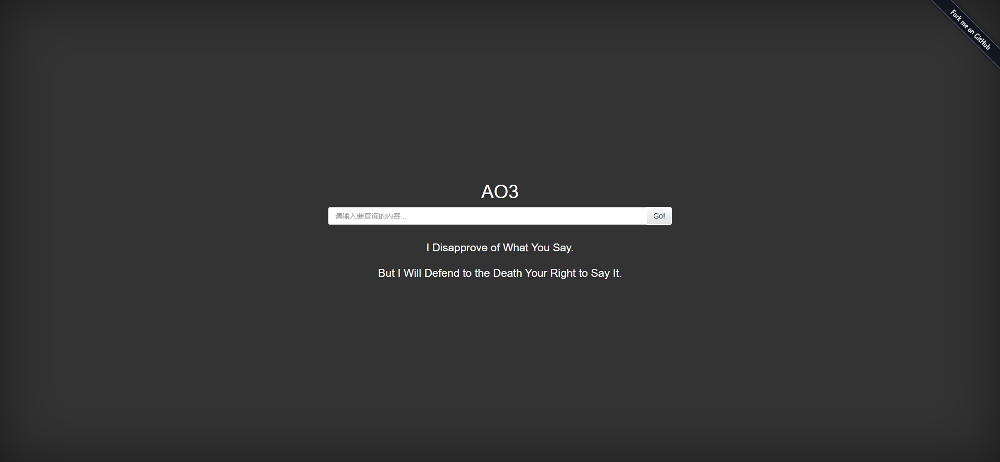
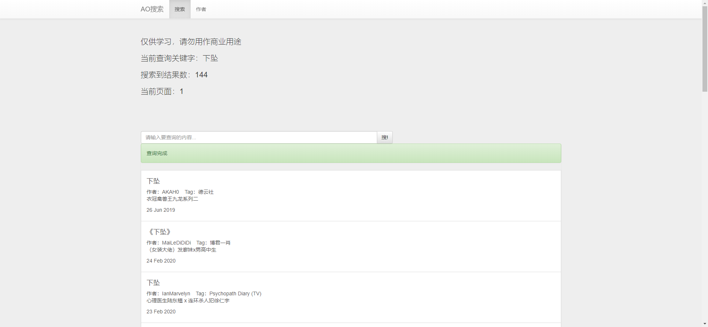
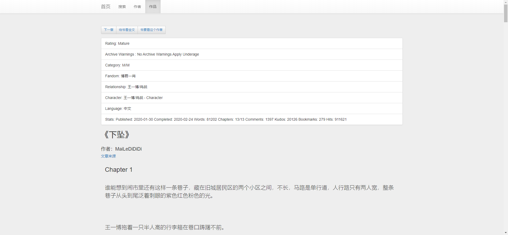
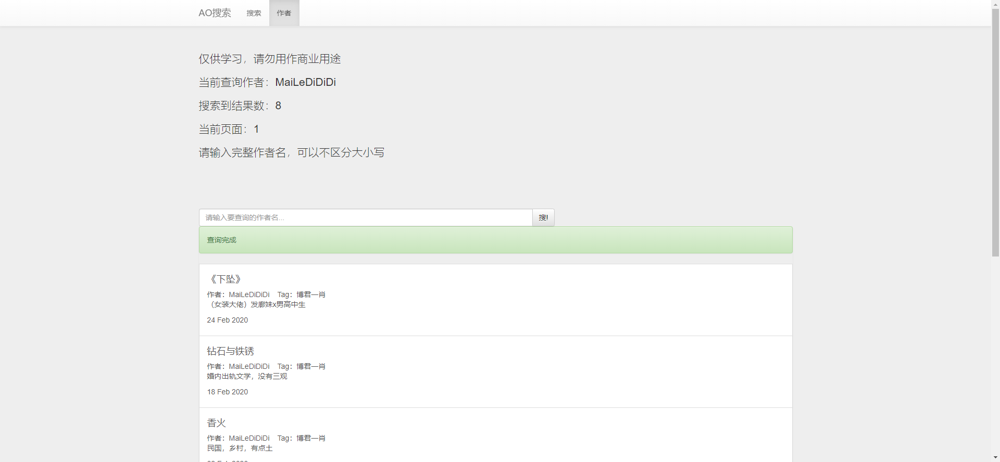

## 众所周知
### ao3被墙了
## 所以
### 这是一个用于代理访问ao3的项目
### 服务器在境外
### 服务器本身不会储存任何内容
### 只会对内容进行转发
### 虽然在两天前才知道ao3
### 虽然我不看 同人作品
### 但是每个人都有爱其所爱的权利
## 创作无罪
## 敬所有作者
### 网址 [ao3.org.cn](https://ao3.org.cn)  
### 网站食用方法：自己探索
### 不可靠的部署方法(需要安装flask)
    git clone https://github.com/xulouzhe/ao3Search.git
    cd ao3Search.git
    python3 ao3.py
### 
## 更新日志
### v1.2
- 简单修复了bug，该bug导致分章节的文章经常无法访问而导致404
- 修复方法为:当访问分章节文章出现404时,会尝试直接显示全文,这可能会导致阅读体验变差
### v1.1
- 更新了查询作者的功能
### v1.0
- 创建项目

## 网页截屏
#### 首页
 
#### 查询页

#### 文章页

#### 查询作者

